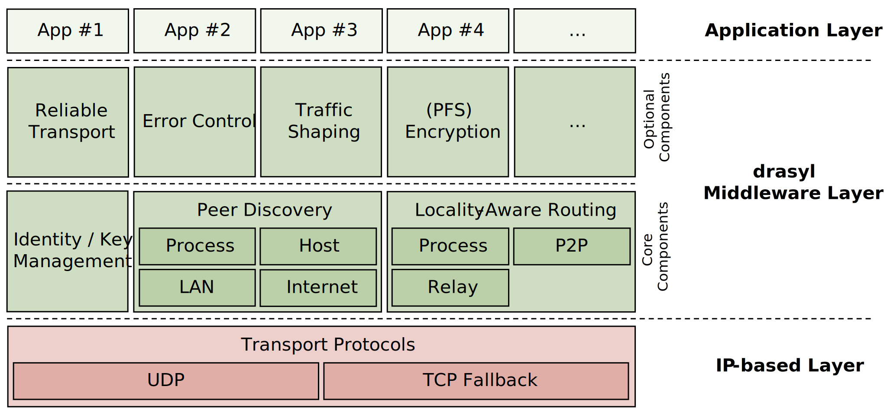

# Welcome

[drasyl](https://github.com/drasyl/drasyl) [dʁazy:l] is a high-performance framework for rapid development of distributed applications.

drasyl enables quick and easy development of high-performance distributed applications. Driven by a secure and low-latency overlay network protocol, drasyl provides any-to-any connectivity between all Internet-enabled devices.

To prevent developers from reinventing the wheel, drasyl provides extensions that address common challenges for distributed systems like identity/key management, resource discovery, and locality-aware message routing. By using drasyl, developers are unburdened of many usual tasks and can proceed directly with building their distributed application.

## Features

* Any-to-any connectivity between all Internet-enabled devices.
* Locality-aware message routing.
* Middlebox traversal (like firewalls or network address translators).
* Driven by a secure & low-latency overlay network protocol.
* Cryptographic identity & key management.
* Rich set of extensions for perfect forward secrecy communication, service & resource discovery, reliable transport, error control, traffic shaping, etc.
